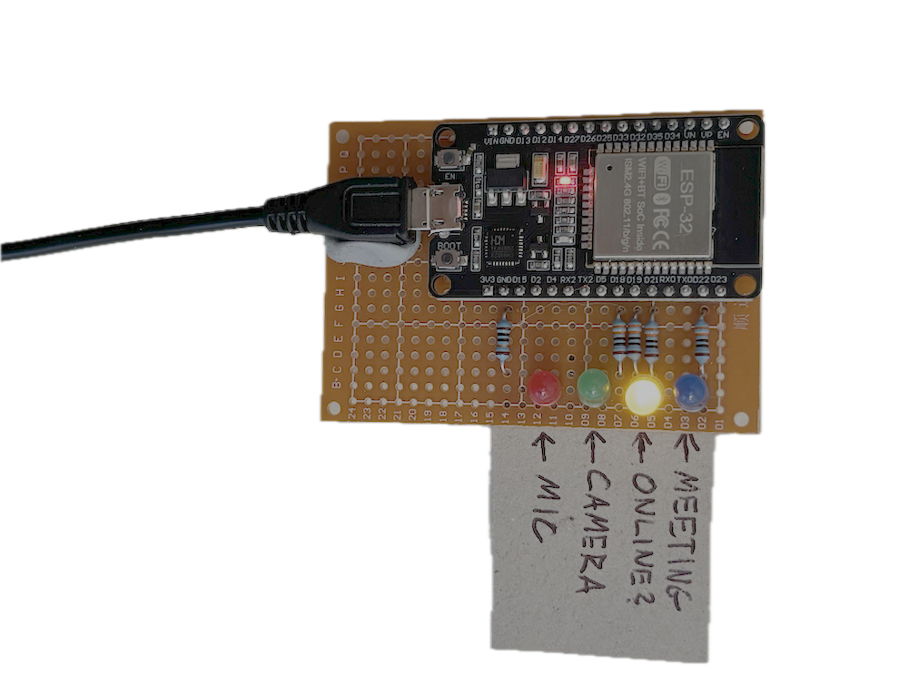
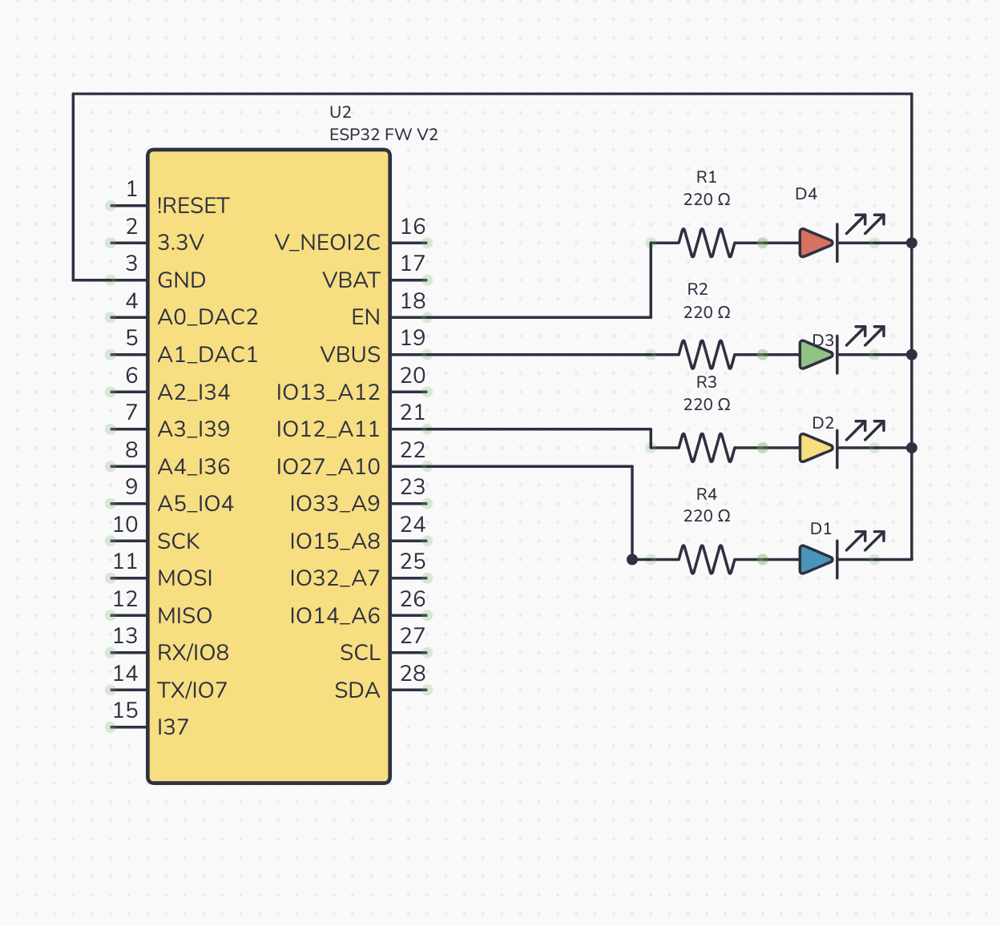

# Microsoft Teams Monitor Box

My WFH office is also my partner's craft room, and she sometimes struggles to tell if I'm in a call or not. To help her, I've created a little box with four LEDs that indicates whether I'm in a meeting, and if my camera and mic is on or not,

## How does it work?
Microsoft Teams has an API for third party devices which needs to be enabled in its settings. On doing this, it exposes its state in a websocket on port :8124. 

I'm running a python client that observes this websocket, and on each update it sends out a request to an ESP32 server, which transmits the current state of my Teams. The ESP32 server receives this and lights up LEDs according to what's passed by the client.

In addition, the client constantly probes the ESP32 - in a 'heartbeat' - which I use to tell whether the device is on. If the heartbeat is not recieved, the device is not on, and my partner knows not to trust the switched off LEDs!

## Repository Structure:

#### PYTHON/ARDUINO:
The repo is split between two services communicating with each other. Each folder contains it's respective code.

    Python -> config.py:
    A place to put any config on the client side, for example the IP address of the ESP32

    Python -> teams_client.py
    Responsible for initiating the Teams Websocket, and instructions on what needs to happen when Teams publishes a change to it's state

    Python -> 
    esp32_client.py:
    Responsible for sending out a request to the ESP32 which contains the state of teams taken from the websocket. Gets called from teams_client.py

    Python -> heartbeat.py
    Responsible for health checking the device. It probes the server for a response, and times out if the response isn't recieved, indicating that the device might not be working properly. If hearbeat is working correctly, the 'Device on' LED is lit up.

#### Arduino:
    teams_box_server.ino:
    Contains a simple server which recieves input from the python client and uses it to control the LED's depending on their state.

## Hardware

#### Components
- ESP32 WROOM-32 Chip
- 4 x LEDs (Blue, Yellow, Green, and Red)
- 4 x 220 Ohm Resitors
- 5 x 7cm Perfboard
- Micro USB cable (power only)
- Soldering iron & Solder (Although initially I used a breadboad for the prototype)
- Blue tac to hold the power cable in place

#### Wiring Diagram
*Created with [Circuit Canvas](https://circuitcanvas.com):*

#### Setup

1) First you need to enable [Teams 3rd Party API](https://support.microsoft.com/en-us/teams/calls-devices/connect-to-third-party-devices-in-microsoft-teams). At the time of writing it's Settings > Privacy > Manage API > Enable API
2) You will need to find out the IP of your ESP32. You can use the Serial Monitor for this, like in [this post](https://community.platformio.org/t/how-do-i-find-the-ip-address-for-esp32/14516) - consult an AI if you are struggling.
3) Update the following files:
    python/config.py: Needs to have the IP address of the ESP32 (from step 2)
    arduino/teams_box_server/teams_box_server.ino: Needs to be updated with the SSID and Password credentials of your local WiFi.
4) Wire the electronics as per the Wiring Diagram above
5) For python, install the required packages in requirements.txt. I suggest using a [virtual environment](https://docs.python.org/3/library/venv.html)
6) Deploy the Arduino code, and then run the 'main.py' file (python run main.py). I powered the Arduino with the micro USB port that it came with. I found it quite flimsy, so have reinforced it with blue tac.
7) Enter a teams call. You will be prompted with a window to accept or decline a 3rd party application. On clicking 'Accept', the blue LED of 'in call' should light up. Have fun!